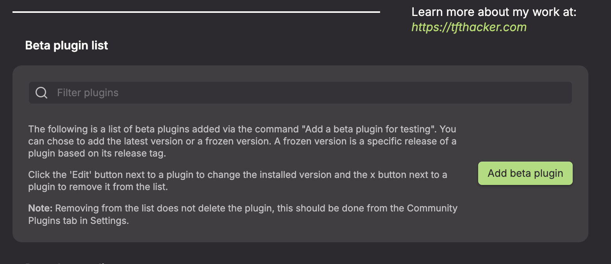

# Auto View Mode

        

<p align="center">
  
</p>

An [Obsidian](https://obsidian.md) plugin that automatically switches between Reading View, Source Mode, and Live Preview when you open a note -- based on a frontmatter key.

## Features

- Set a per-note view mode using frontmatter
- Configurable frontmatter key name (default: `auto-view-mode`)
- Supports all three Obsidian view modes: Reading View, Source Mode, and Live Preview
- Lightweight with no external dependencies

## Installation

### Obsidian Community Plugin (pending)

This plugin has been submitted for review to the Obsidian community plugin directory. Once approved, you will be able to install it directly from **Settings > Community plugins > Browse** by searching for "Auto View Mode".

### Using BRAT

You can install this plugin right now using the [BRAT](https://github.com/TfTHacker/obsidian42-brat) plugin:

1. Install BRAT from **Settings > Community plugins > Browse** (search for "BRAT" by TfTHacker)
2. Open the BRAT settings
3. Under the **Beta plugins** section, click **Add beta plugin**

   

4. In the overlay, enter this plugin's repository: `https://github.com/saltyfireball/obsidian-auto-view-mode` (or just `saltyfireball/obsidian-auto-view-mode`)

   

5. Leave the version set to latest

   

6. Click **Add plugin**

### Manual

1. Download the latest release from the [Releases](https://github.com/saltyfireball/obsidian-auto-view-mode/releases) page
2. Copy `main.js` and `manifest.json` into your vault's `.obsidian/plugins/auto-view-mode/` directory
3. Enable the plugin in **Settings > Community plugins**

## Usage

Add the frontmatter key to any note to control which view mode it opens in:

```yaml
---
auto-view-mode: preview
---
```

### Accepted Values

| Value                  | View Mode    |
| ---------------------- | ------------ |
| `preview` or `reading` | Reading View |
| `source`               | Source Mode  |
| `edit` or `live`       | Live Preview |

### Custom Frontmatter Key

By default the plugin reads from the `auto-view-mode` frontmatter key. You can change this to any name you like in the plugin settings:

1. Go to **Settings** > **Auto View Mode**
2. Change the **Frontmatter key** field to your preferred key name

For example, if you set it to `view`, your frontmatter would look like:

```yaml
---
view: source
---
```

## License

[MIT](LICENSE)
